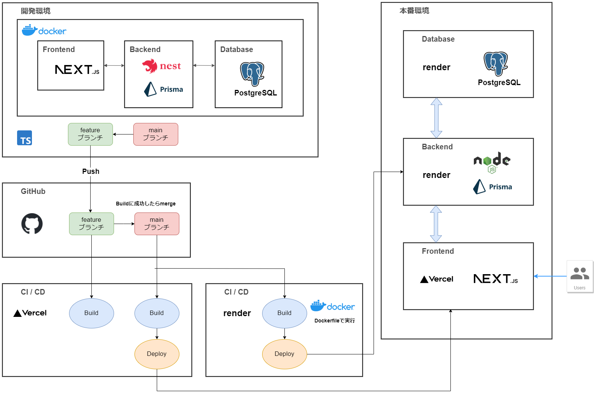

# :grey_question:Curio Nest

日々の疑問を記録し管理するためのWebアプリです。

以前作成した、「ShiRiTai」というアプリ(https://github.com/khkmgch/ShiRiTai) に

データベースとバックエンドの機能を追加し、フルスタックアプリとして改良したものです。

Prismaを使ってPostgreSQLのデータベース操作を行っています。

## :globe_with_meridians:Url
https://curio-nest.vercel.app/

## :desktop_computer:Demo

## :blue_book:バックエンドAPI仕様書
https://khkmgch.github.io/curio-nest/

## :joystick:遊び方
対戦ルームを作成、入室し、ゲームを開始します。

⬆️ :arrow_right: ⬇️ ⬅️で移動し、SpaceキーでBombを設置できます。

最後まで生き残ると勝利です。

## :eyes:作成理由

#### 気軽に集まれる場所を提供するため
以前から気軽に集まれる楽しい場所:handshake:を作りたいと考えており、

小規模ですがそのような場所を提供するための第一歩になると考え、作成に至りました。

#### 自己紹介のため
また、話下手な作者が自己紹介:raising_hand_man:する際に、人となりを表現し、印象に残る自己紹介をするために作成しました。

#### レベルアップのため
さらに、フルスタックな技術が必要なアプリをゴールに設定することで、作者のレベルアップ:muscle:を図りました。

## :clock3:期間
2023年2月から2か月半ほど

## :hammer_and_wrench:使用技術

### 開発
- Docker / Docker Compose
- Typescript
- Vite
### バックエンド
- NestJS(NodeJS)

### フロントエンド
- Phaser3
### 通信
- Socket.io
### CI/CD
- バックエンド
  - Google Cloud Build
  - Google Cloud Run
- フロントエンド
  - Vercel

## 📗それぞれの技術の採用理由
### Typescript
  - これまでJavascriptで開発しており、型のあるTypesciptで書いてみたかった
  - 継続的に開発する際には型がある方が管理しやすいと考えた
### NestJS
  - Typescriptで構築されたフレームワークである
  - MVC(Model-View-Controller)に基づいている
    - アプリの各部分をモジュールとして分割して開発や拡張ができるため
    - モデルとコントローラの分離により、ロジックとリクエストの処理を分けて管理できるため

### Docker / Docker Compose / Google Cloud Build / Google Cloud Run

以前の開発で、開発環境と本番環境の違い(パッケージのバージョンなど)によりデプロイに失敗した経験がありました。

そこで、Dockerコンテナを使用して開発し、Cloud Buildを使ってコンテナ環境をデプロイすることによって、

開発環境と本番環境を揃える方法を採用しました。

### Vite

「ES modules」と呼ばれるモジュール分割の仕組みを使い、必要な時に必要なファイルだけをビルドします。

プロジェクトの規模が拡大しても起動や更新が高速で行えるため採用しました。

### Phaser

最初はCanvasAPIのみで実装しており記述が煩雑でコード量が多くなってしまいました。

そこで、ゲームアニメーションの描画を簡潔な記述で行えるPhaserライブラリを採用しました。

## :pushpin:特にこだわった箇所
### ①Npcのアルゴリズム
ゲームの難易度を上げて面白くするために、

周囲の状況を基に最適な行動を選択する敵キャラを実装しました。

#### <Npcの行動>
- 爆弾を回避
- プレイヤーを攻撃
- アイテムを取得
- 障害物を破壊

#### <経路探索に活用したアルゴリズム>
- **ダイクストラ法** 

障害物を考慮して、Npcが移動できる範囲を $O(NlogN)$ で探索するため、後述の優先度付きキューを活用したダイクストラ法を用いました。

$$ f_n = f_{n-1} + g_n $$

$$ \text{時間計算量: O(NlogN)} $$

- **AStarアルゴリズム**

目標マスへの最適な経路を $O(NlogN)$ で探索するため、後述の優先度付きキューやメモ化を活用したAStarアルゴリズムを用いました。

なお、ヒューリスティックコスト $h_n$ にはマンハッタン距離に加えて、後述の影響マップの値を用いることで、ステージの状況をより正確に判断できるように工夫しました。

また、OPEN/CLOSEDリストには $O(1)$ でアクセスできるハッシュマップを採用しました。

$$ f_n = f_{n-1} + h_n $$

$$ h_n = \text{manhattan distance} + \text{value of impactmap} $$

$$ \text{manhattan distance} = \text{di(}g_i - f_i\text{)} + \text{dj(}g_j - f_j\text{)} $$

$$ g = \text{target cell} $$

$$ \text{時間計算量: O(NlogN)} $$

参考: https://2dgames.jp/a-star/

- **優先度付きキュー**

２分ヒープを用いて、Topを $O(1)$ 、Popを $O(logN)$ 、Insertを $O(logN)$ で行う優先度付きキューを実装しました。

- **影響マップ**

戦略的な重要度など、Npcの行動の指標となる評価を空間上に直接マッピングしたものです。

例えば、ステージのそれぞれのマスに対して、アイテムとの距離を評価値としてマッピングしたものを作成して使いました。

参考: https://tech.cygames.co.jp/archives/2272/

### ②通信の仕組み
リアルタイムに情報を共有することが必要なため、Socket.ioを使用しました。

また、プレイヤー間のラグを減らすためにゲームの状態をサーバのみで管理し、クライアントは描画とキー入力のみを行うようにしました。

### ③拡張性
継続的に開発してバージョンアップできるよう、OOPやAbstractFactoryパターンを用いて設計・実装しました。

以下はUML(Unified Modeling Language)図です。

- **クラス図**

関連・多重度・集約・継承などを意識し、ゲーム内のオブジェクトをOOPで設計しました。

- **デザインパターン図**

AbstractFactoryパターンを用いることで、複数の種類のステージを実装できるように設計しました。

### ④Type Guard
データの送受信を型安全に行い予期しないエラーを防ぐため、Type Guardを用いてクライアント側で受け取るオブジェクトのデータ型を制限しました。

参考: https://typescript-jp.gitbook.io/deep-dive/type-system/typeguard#riterarunotype-guard

### ⑤UI
ほっこりするようなデザインの素材を使い、一部素材は自作しました。

## :scroll:Draft

### 全体の流れ

### Wireframe

## :muscle:苦労した点

### ①Npcのアルゴリズム
先述の記事を参考にしながら、影響マップやAStarアルゴリズムなどを用いて

最適なターゲットと経路を探索する仕組みを考えるのに時間がかかりました。
### ②入・退室の処理
Socket.ioのRoomsという機能を使いました。

通常の入退室に加えて、接続が切れた際に退室させる処理や、更新のない対戦ルームを削除する処理など、

１つ１つ仕組みを考えていきました。
### ③当たり判定
爆弾、爆風、アイテムや障害物との当たり判定の仕組みを考えるのに苦労しました。

### ④UI
Phaser独特の書き方があり、1箇所ずつドキュメントを参照しながら実装したため

時間がかかりました。
