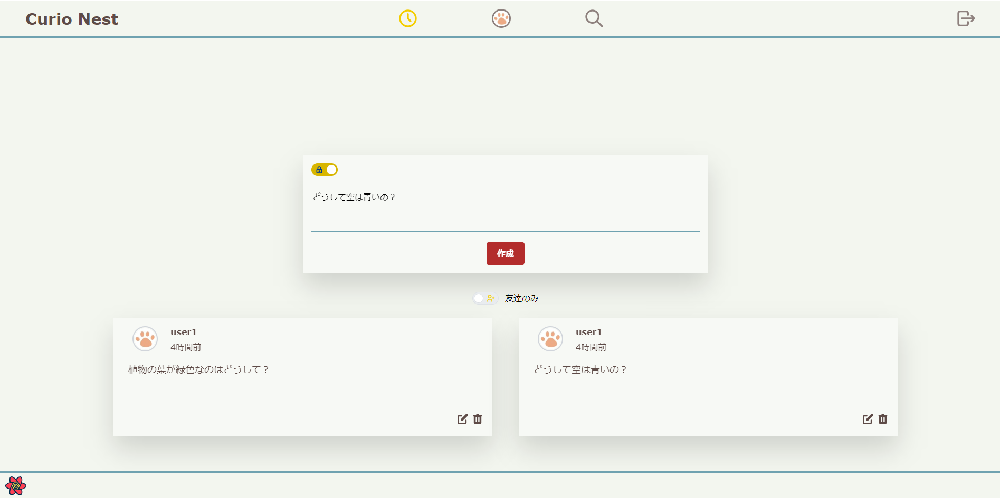
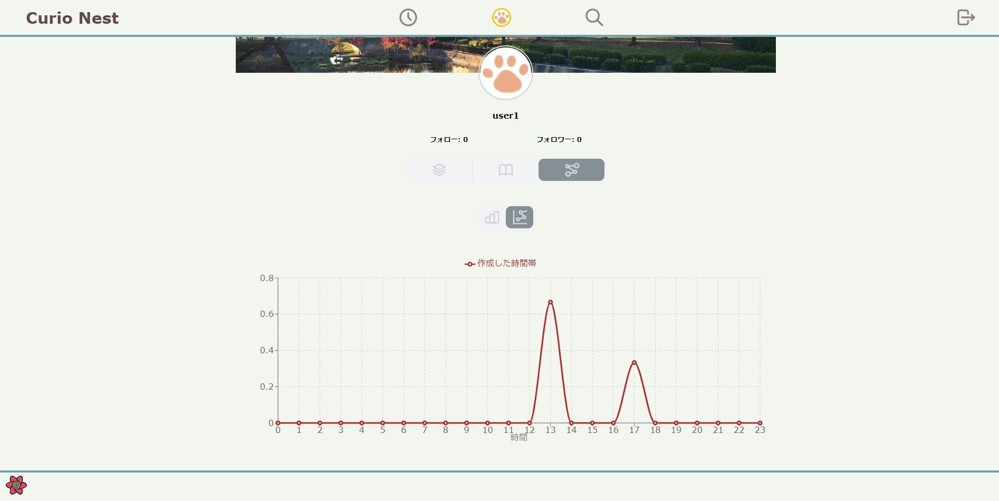
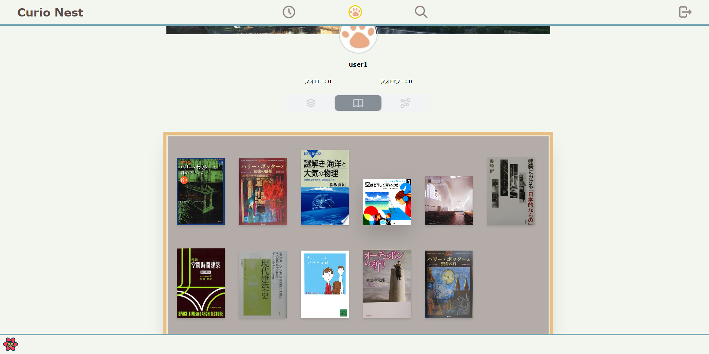
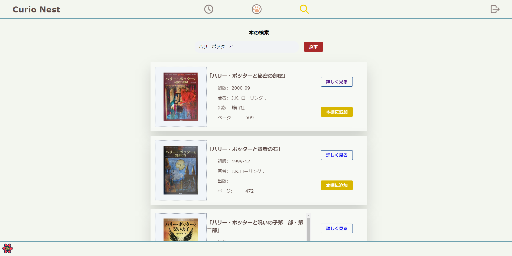
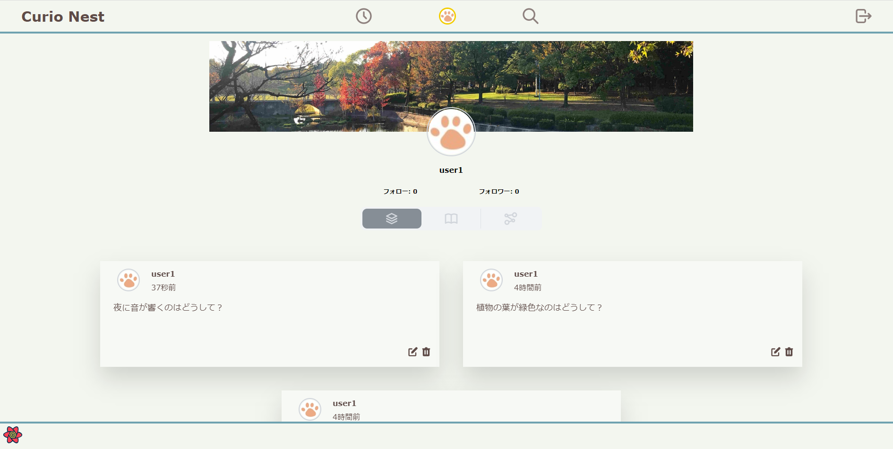
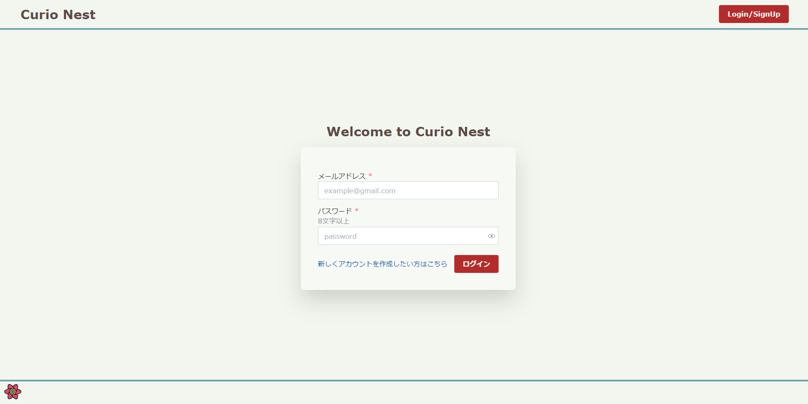
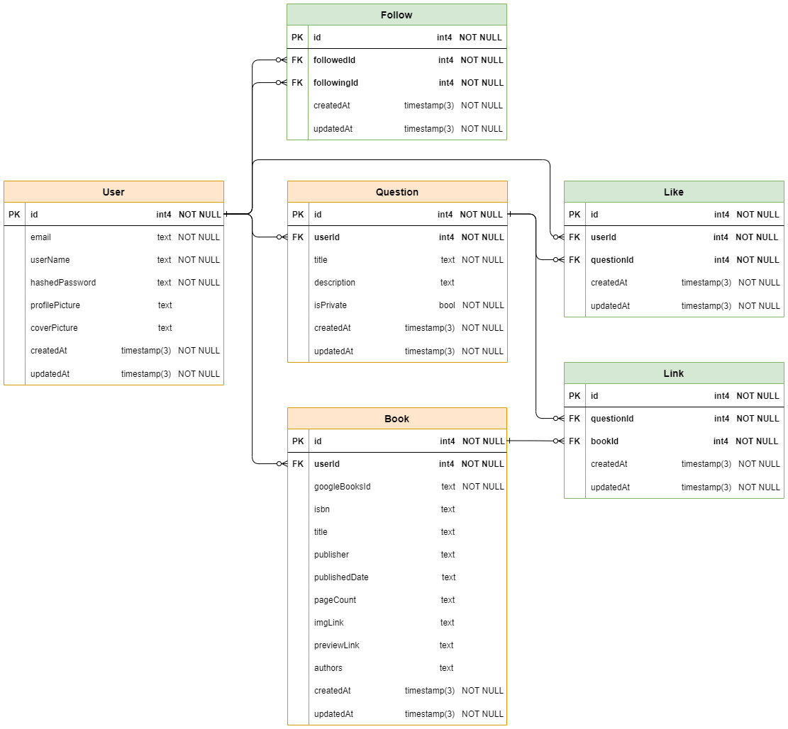

# :grey_question:Curio Nest

日々の疑問を記録し管理するためのWebアプリです。

以前作成した、「ShiRiTai」というアプリ(https://github.com/khkmgch/ShiRiTai) に

データベースとバックエンドの機能を追加し、フルスタックアプリとして改良したものです。

Prismaを使ってPostgreSQLのデータベース操作を行っています。

## :globe_with_meridians:Url
https://curio-nest.vercel.app/

## :desktop_computer:Demo

## :blue_book:バックエンドAPI仕様書
https://khkmgch.github.io/curio-nest/

## :joystick:使い方/機能
### :orange_circle:主な流れ
1. 疑問を記録・投稿します
2. AIに、参考になる本を提案してもらいます
3. 本を本棚に追加し、疑問と紐づけします
4. 疑問が解決したら、記録に追記します

### :pencil2:記録
疑問を記録します。

公開/非公開の設定ができます。

### :memo:編集
#### AIレコメンド機能
記録した疑問を解決するために、参考になりそうな本をAIに提案してもらうことができます。

本はMy本棚に追加することができます。

#### 答えを記入
レコメンド機能でおすすめされた本を読み、疑問が解決したら答えを書きましょう。

#### 本との紐づけ機能
疑問の解決のために読んだ本を疑問と紐づけしておくことで、

再度見返した際に思考過程を振り返るための助けになります。

### :chart_with_downwards_trend:分析
記録された疑問を集計し、データをグラフで表示します。

あなたの疑問が生まれやすい時間帯や日付がひと目で分かります。

### :books:My本棚
読んだ本を追加して管理することができます。

他の人の本棚も覗けます。

### :mag:本の検索
AIレコメンド機能で気に入った本がなければ、キーワード検索することができます。

### :people_holding_hands:タイムライン
タイムラインから他の人の疑問を見ることができます。

また、他の人の疑問に共感したら、１クリックで自分の疑問として追加することができます。

### リマインド
未解決の疑問は１週間後にリマインドされます。

### :raising_hand_man:プロフィール
#### フォロー
気に入ったユーザーがいれば、フォローできます。
#### 画像アップロード
SNSのように、プロフィール画像を好みのものに変更できます。

### :old_key:認証
メールアドレスとパスワードを用いて認証を行います。

新規登録/ログイン/ログアウト機能を実装しています。

## :eyes:作成理由

#### 日々の疑問をそのままにしないため
疑問は好奇心の種として貴重なものと考えられます。

私は生活の中で湧いた疑問を、書き留めずにそのまま忘れてしまうことがありました。

また、ノートやスマホメモに書き留めても見返すことなくそのままにしてしまう場合もあり、

これらをもったいない:exclamation:と感じたことが原点です。

解決策として、疑問を管理するためのアプリが欲しいと考え、作成に至りました。

#### 新たな疑問を促すため
また、多様な人が集まり繋がれる:handshake:というWebアプリの特性を利用することで、

他のユーザーが記録した疑問を覗き、新たな疑問が湧くことを促すことができると考えました。

#### レベルアップのため
さらに、フルスタックな技術が必要なアプリをゴールに設定することで、作者のレベルアップ:muscle:を図りました。

## :clock3:期間
2022年10~11月、2023年5月の合計3ヶ月程

## :hammer_and_wrench:使用技術

### 開発環境
- Docker / Docker Compose
### バックエンド
- NestJS (NodeJS)
- Typescript
- Prisma (データベース操作)

### データベース
- PostgreSQL

### フロントエンド
- NextJS
- Typescript
- Tailwind CSS
- Mantine
- zustand (状態管理)

### ホスティング
- バックエンド
  - ~~Google Cloud Build~~
  - ~~Google Cloud Run~~
  - render
- データベース
  - ~~Google Cloud SQL~~
  - render
- フロントエンド
  - Vercel

## 📗それぞれの技術の採用理由
### Docker / Docker Compose
以前の開発で、開発環境と本番環境の違い(パッケージのバージョンなど)によりデプロイに失敗した経験がありました。

そこで、Dockerコンテナを使用して開発し、Dockerfileを使ってコンテナ環境をビルド・デプロイすることによって、

開発環境と本番環境を揃え、ホスティングをスムースに行えるようにしました。

### Typescript
  - これまでJavascriptで開発しており、型のあるTypesciptで書いてみたかった
  - 継続的に開発する際には型がある方が管理しやすいと考えた
  - 
### NestJS
  - Typescriptで構築されたフレームワークである
  - MVC(Model-View-Controller)に基づいている
    - アプリの各部分をモジュールとして分割して開発や拡張ができる
    - モデルとコントローラの分離により、ロジックとリクエストの処理を分けて管理できる
    - プロジェクトのメンテナンス性が高まる
   
### Prisma
- SQLを書かずに、データベースへのアクセスやデータ操作を簡単に行えるため、迅速に開発することができる。
- データベースのスキーマをコードベースで定義
  - モデルの変更や追加が容易なので、アプリの要件の変更に迅速に対応することができる。
  - モデルに基づいて型安全なコードを自動生成できるため、タイプミスによる問題を事前に防ぐことができる。
  - データベースのスキーマ管理やマイグレーションを簡単に行える
- 複数のデータベースシステム（MySQL、PostgreSQL、SQLiteなど）に対して一貫したインターフェースを提供しているため、異なるデータベース間での移行や切り替えが容易。

### NextJS
- 簡単にセットアップでき、新しいプロジェクトの立ち上げを素早く行える。
- ダイナミックなルーティングやネストされたルーティングを簡単に設定することができる。

### Mantine
- UIコンポーネントを利用することで、開発時間を短縮できる。

### Tailwind CSS
- 色や線などの細かい設定が可能
- 予め用意されたボタンなどがなく、記述量が多くなってしまうため、Mantineと併用する

### Zustand
- 簡潔な記述で状態管理を行える
  
## :pushpin:特にこだわった箇所
### 疑問の解決を手助け
- AI機能により、疑問の解決を手助けする機能を実装
### 思考過程を記録
- 疑問と本を紐づける
### 本棚
- 自分の読んだ本を管理する
- 他のユーザーの本棚を覗いてみたいという作者の好奇心

### ①Npcのアルゴリズム
ゲームの難易度を上げて面白くするために、

周囲の状況を基に最適な行動を選択する敵キャラを実装しました。

#### <Npcの行動>
- 爆弾を回避
- プレイヤーを攻撃
- アイテムを取得
- 障害物を破壊

#### <経路探索に活用したアルゴリズム>
- **ダイクストラ法** 

障害物を考慮して、Npcが移動できる範囲を $O(NlogN)$ で探索するため、後述の優先度付きキューを活用したダイクストラ法を用いました。

$$ f_n = f_{n-1} + g_n $$

$$ \text{時間計算量: O(NlogN)} $$

- **AStarアルゴリズム**

目標マスへの最適な経路を $O(NlogN)$ で探索するため、後述の優先度付きキューやメモ化を活用したAStarアルゴリズムを用いました。

なお、ヒューリスティックコスト $h_n$ にはマンハッタン距離に加えて、後述の影響マップの値を用いることで、ステージの状況をより正確に判断できるように工夫しました。

また、OPEN/CLOSEDリストには $O(1)$ でアクセスできるハッシュマップを採用しました。

$$ f_n = f_{n-1} + h_n $$

$$ h_n = \text{manhattan distance} + \text{value of impactmap} $$

$$ \text{manhattan distance} = \text{di(}g_i - f_i\text{)} + \text{dj(}g_j - f_j\text{)} $$

$$ g = \text{target cell} $$

$$ \text{時間計算量: O(NlogN)} $$

参考: https://2dgames.jp/a-star/

- **優先度付きキュー**

２分ヒープを用いて、Topを $O(1)$ 、Popを $O(logN)$ 、Insertを $O(logN)$ で行う優先度付きキューを実装しました。

- **影響マップ**

戦略的な重要度など、Npcの行動の指標となる評価を空間上に直接マッピングしたものです。

例えば、ステージのそれぞれのマスに対して、アイテムとの距離を評価値としてマッピングしたものを作成して使いました。

参考: https://tech.cygames.co.jp/archives/2272/

### ②通信の仕組み
リアルタイムに情報を共有することが必要なため、Socket.ioを使用しました。

また、プレイヤー間のラグを減らすためにゲームの状態をサーバのみで管理し、クライアントは描画とキー入力のみを行うようにしました。

### ③拡張性
継続的に開発してバージョンアップできるよう、OOPやAbstractFactoryパターンを用いて設計・実装しました。

以下はUML(Unified Modeling Language)図です。

- **クラス図**

関連・多重度・集約・継承などを意識し、ゲーム内のオブジェクトをOOPで設計しました。

- **デザインパターン図**

AbstractFactoryパターンを用いることで、複数の種類のステージを実装できるように設計しました。

### ④Type Guard
データの送受信を型安全に行い予期しないエラーを防ぐため、Type Guardを用いてクライアント側で受け取るオブジェクトのデータ型を制限しました。

参考: https://typescript-jp.gitbook.io/deep-dive/type-system/typeguard#riterarunotype-guard

### ⑤UI
ほっこりするようなデザインの素材を使い、一部素材は自作しました。

## :scroll:Draft

### 全体の流れ

### Wireframe

## データベース

## :muscle:苦労した点

### ①Npcのアルゴリズム
先述の記事を参考にしながら、影響マップやAStarアルゴリズムなどを用いて

最適なターゲットと経路を探索する仕組みを考えるのに時間がかかりました。
### ②入・退室の処理
Socket.ioのRoomsという機能を使いました。

通常の入退室に加えて、接続が切れた際に退室させる処理や、更新のない対戦ルームを削除する処理など、

１つ１つ仕組みを考えていきました。
### ③当たり判定
爆弾、爆風、アイテムや障害物との当たり判定の仕組みを考えるのに苦労しました。

### ④UI
Phaser独特の書き方があり、1箇所ずつドキュメントを参照しながら実装したため

時間がかかりました。
